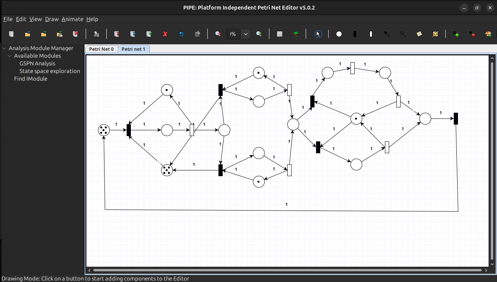

# Concurrency Monitor - Petri Nets

  
  
  

> Implementación de simulación de una Red de Petri, administrando la concurrencia de la red a través de un monitor.

 

    

 

---

## Descripción
El presente proyecto implementa un monitor de concurrencia 

## Objetivos
## Tecnologías Utilizadas
## Características Principales
## Arquitectura del Sistema

## Documentación Adicional

## Autor

## Licencia

  

Copyright (c) 2025 Sassi Juan Ignacio